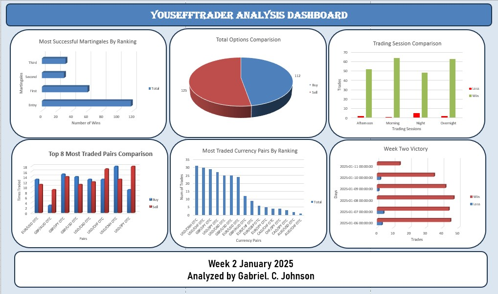
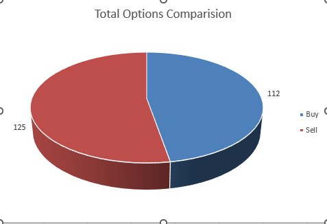
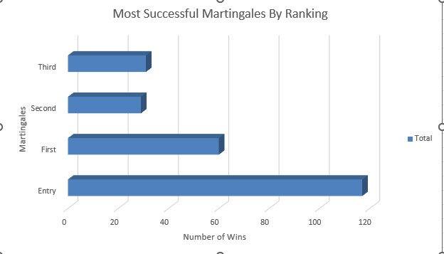
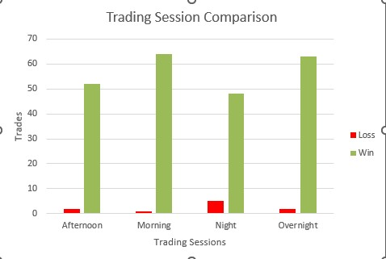
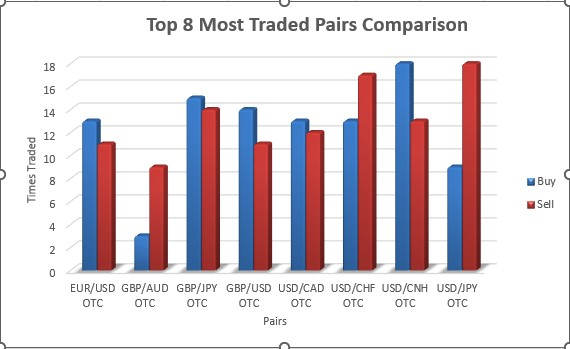
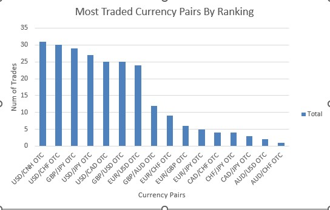
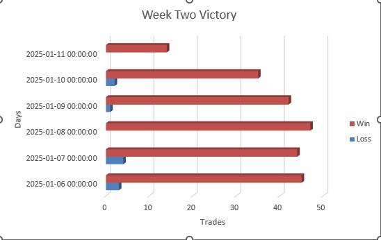

# Youseff Option Trade Reports Analysis

## Project Overview

This project focuses on analyzing Youseff's option trade reports to derive meaningful insights, identify trading patterns, and explore strategies that contributed to trading outcomes. The analysis will involve cleaning, organizing, and visualizing data from the raw Excel file to provide actionable insights.

---

## Charts and Insights

### Dashboard Overview

**Description:** A comprehensive view of YouseffTrader's performance and trading trends for Week 2 of January 2025.

### Total Options Comparison

**Description:** A breakdown of total Buy and Sell trades, showcasing the distribution of trading activity.

### Most Successful Martingales By Ranking

**Description:** Ranking of the most successful Martingale strategies based on the number of wins.

### Trading Session Comparison

**Description:** A comparison of trading session performance across different times of the day.

### Top 8 Most Traded Pairs Comparison

**Description:** A bar chart illustrating the Buy and Sell distribution of the top 8 traded currency pairs.

### Most Traded Currency Pairs By Ranking

**Description:** Ranking of currency pairs by trading frequency, showing the most traded pairs overall.

### Week Two Victory Analysis

**Description:** A detailed analysis of daily trade victories during Week 2 of January 2025.

---


## Goals of the Project

1. Understand the overall performance of trades.
2. Identify trends in trading activity over time.
3. Analyze the success rates and profitability of different strategies.
4. Present the findings through clear visualizations and summaries.

## Tools and Libraries

The following tools and libraries will be used throughout this analysis:

- **Python**: For data manipulation and analysis.
- **Pandas**: To clean and preprocess the data.
- **Matplotlib/Seaborn**: For visualizing trading patterns and results.
- **Jupyter Notebook**: For interactive data exploration.
- **Excel**: To view and cross-check raw data.

---

## Step 1: Initial Data Exploration

**Objective:** The first step involves loading the raw data from the Excel file, understanding its structure, and identifying potential issues that need to be addressed before analysis.

### Steps:
1. Import the raw Excel file into Python using **Pandas**.
2. Inspect the dataset to understand its columns, data types, and initial observations.
3. Look for missing values, duplicates, and formatting inconsistencies.
4. Document key observations from the raw dataset.

### Code Example:
Here’s a sample script to load and explore the data:

```python
import pandas as pd

# Load the raw Excel file
file_path = 'Youseff Trade Analysis Week 2 2025.xlsx'
data = pd.read_excel(file_path)

# Display the first few rows of the dataset
print(data.head())

# Get a summary of the dataset
print(data.info())

# Check for missing values
print(data.isnull().sum())
```

### Expected Outcome:
- A clear understanding of the data structure (columns, rows, and types).
- Notes on any cleaning/preprocessing steps required.
